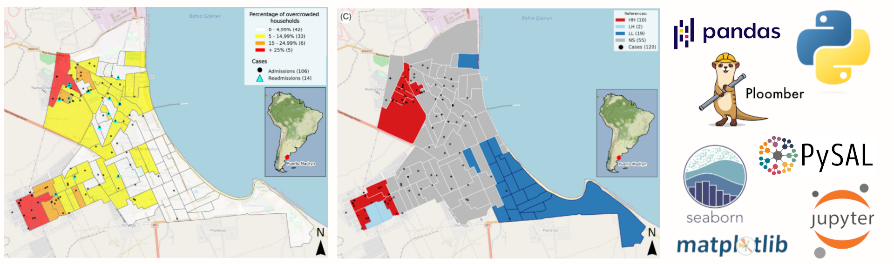
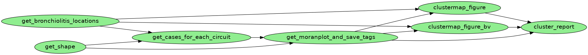

PI-Bronquiolitis 

Setup:
- Get the input-data folder
- Chage project root_path in env.yaml

Using ploomber pipelines:

```
> ./install_packages.sh
> ploomber build
```

Inspect `_output` folder



